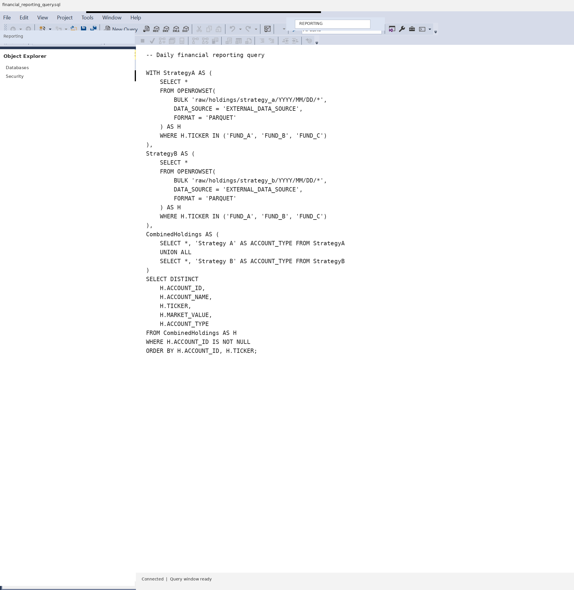
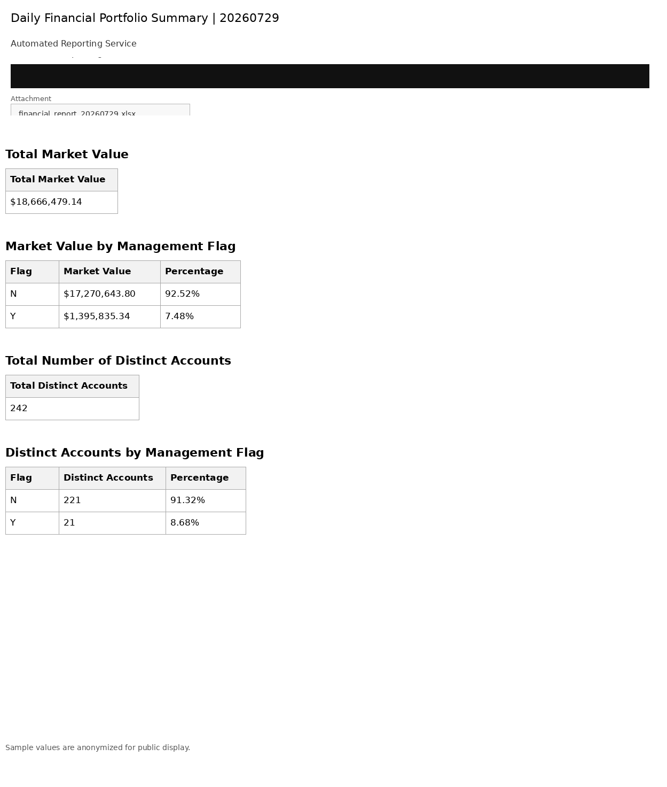

# Financial Data Pipeline Automation

This project shows how I replaced a daily manual reporting process with a SQL and Python workflow that runs in about three minutes.

Before the automation, someone on the team had to run large extracts from a trading platform, wait roughly 30 minutes for the data, clean and format the results in Excel, identify about 500 qualifying accounts from hundreds of thousands of records, and prepare an email for distribution. The full process regularly took more than an hour each business day.

The completed workflow runs the query, creates the Excel report, calculates the summary metrics, attaches the output, and prepares or sends the email automatically.

## Why this was an end-to-end data pipeline project

The required data was not all available in the data lake when the project started. One of the fields needed to identify the correct accounts existed only inside the trading platform.

I created a new report within that platform to expose the missing field. I then worked with the third-party platform vendor to have the report generated every business day and delivered automatically. After that, I partnered with internal engineering teams to define the ingestion requirements and add the report to the daily data pipeline.

Once the upstream data was available, I built the SQL and Python pieces that completed the reporting process. The project gave me direct involvement across the full pipeline:

- source report design
- third-party vendor coordination
- ingestion requirements
- data lake integration
- SQL filtering and joins
- Python automation
- Excel output
- Outlook email delivery
- weekday scheduling

## Time savings

| Step | Before | After |
|---|---:|---:|
| Trading-platform report generation | About 30 minutes | Scheduled automatically |
| Excel cleanup and formatting | 30 minutes or more | Automated |
| Account identification | Manual review | Automated SQL filtering |
| Email preparation | Manual | Automated |
| Total daily process | More than 60 minutes | About 3 minutes |

The workflow reduced daily processing time by roughly 95 percent and removed about 250 hours of repetitive work over a typical business year.

## How the workflow works

1. The trading platform generates a scheduled source report.
2. The report is ingested into the enterprise data platform.
3. SQL joins the required datasets and filters hundreds of thousands of records down to the target population.
4. Python exports the result to a dated Excel workbook.
5. Python calculates total market value and distinct-account metrics.
6. A formatted Outlook email is created with the workbook attached.
7. Windows Task Scheduler runs the process every weekday.

## Screenshots

The screenshots come from the original workflow. Company names, personal information, internal infrastructure, and business-specific labels were removed before publication.

### SQL workflow



### Automated email summary



### Weekday schedule


## Repository contents

```text
financial-data-pipeline-automation/
├── README.md
├── LICENSE
├── SECURITY.md
├── .gitignore
├── requirements.txt
├── config.example.env
├── run_pipeline.bat
├── python/
│   ├── run_reporting_query.py
│   └── send_daily_summary.py
├── sql/
│   └── financial_reporting_query.sql
├── docs/
│   └── screenshots/
│       ├── sql_workflow.png
│       ├── email_summary.png
│       └── scheduled_task.png
└── sample_output/
    └── sample_financial_report.xlsx
```

## Running the project

This public version keeps server names, paths, recipients, credentials, and environment-specific source locations outside the repository.

Install the dependencies:

```powershell
py -3 -m pip install -r requirements.txt
```

Copy the example configuration and update it for your environment:

```powershell
Copy-Item config.example.env .env
```

Load the values into your current PowerShell session:

```powershell
Get-Content .env | ForEach-Object {
    if ($_ -and -not $_.StartsWith('#')) {
        $name, $value = $_ -split '=', 2
        Set-Item -Path "Env:$name" -Value $value
    }
}
```

Run the full workflow:

```powershell
.\run_pipeline.bat
```

The default email mode is `draft`, which opens the message for review. Set `REPORTING_EMAIL_MODE=send` only after testing the workflow in your own environment.

## Sample data

The workbook in `sample_output` contains 500 fictional accounts and anonymized values. It is included to show the expected report structure without exposing production data.

## Security

This repository does not contain employer names, credentials, internal email addresses, production server names, network paths, proprietary dataset names, or real account data. See [SECURITY.md](SECURITY.md) for additional details.
